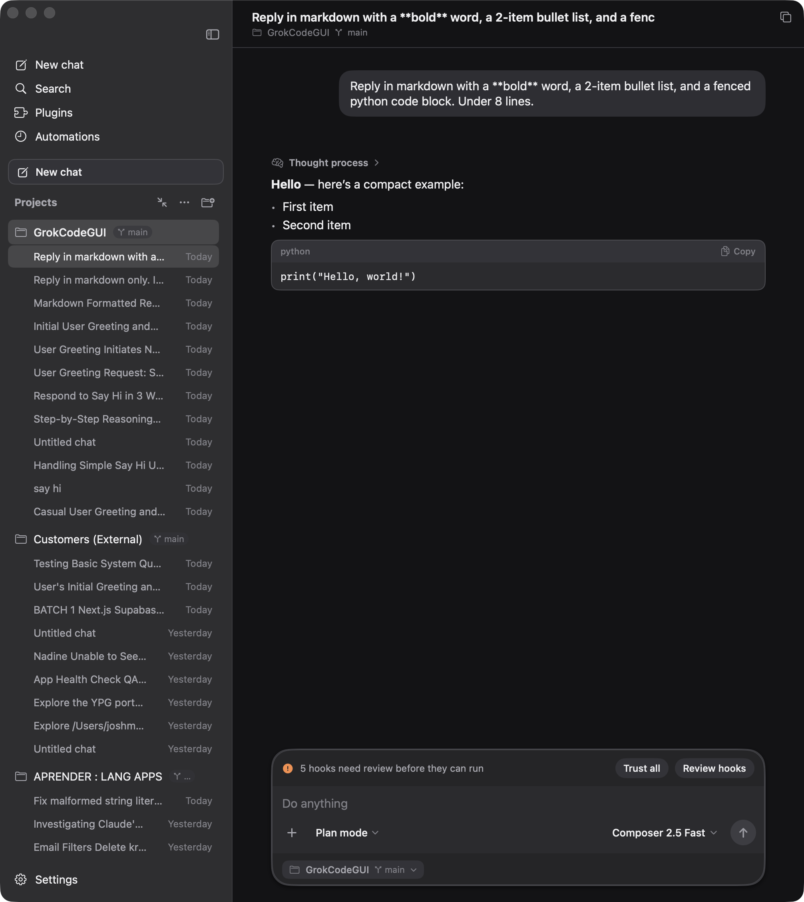
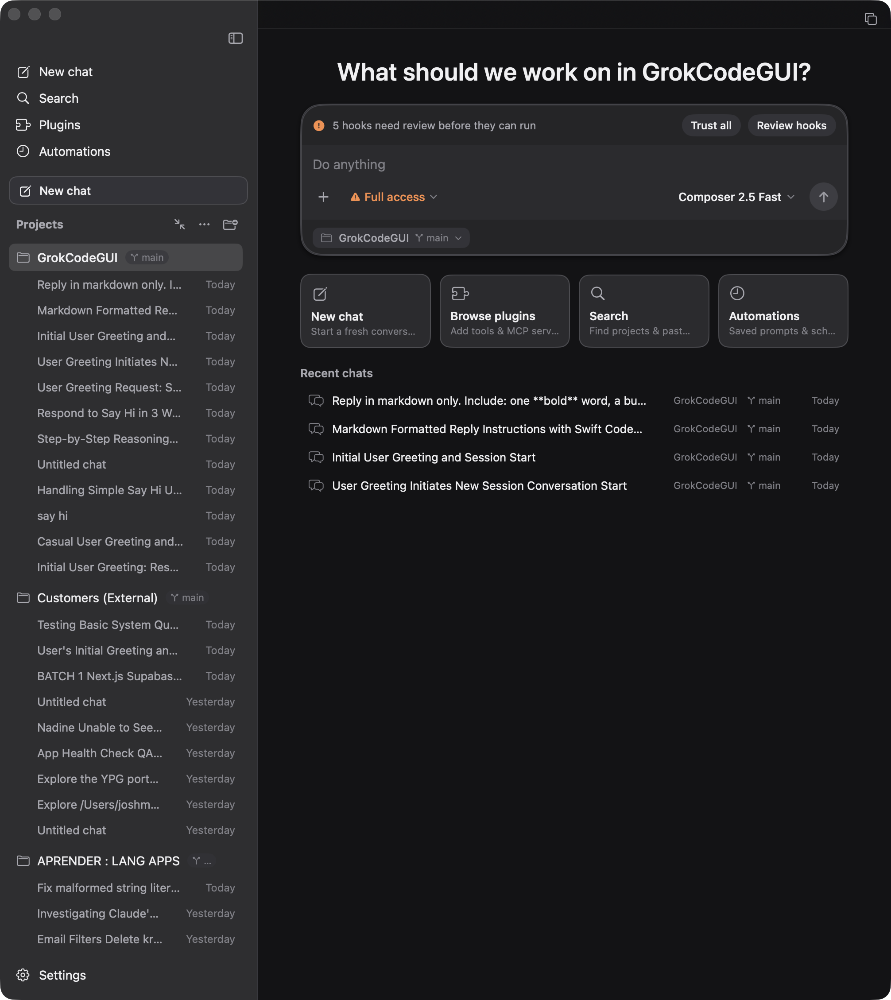
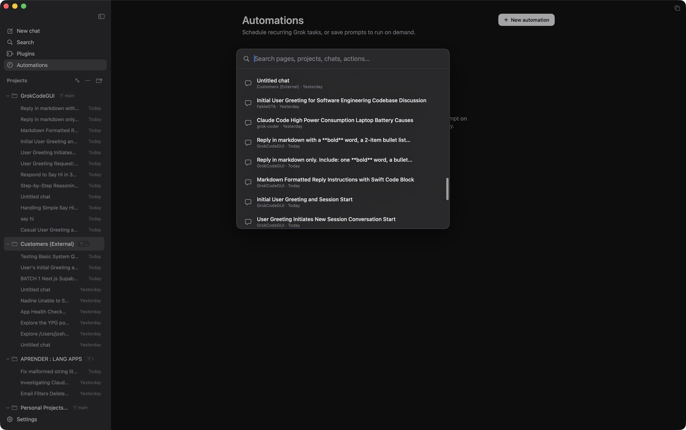
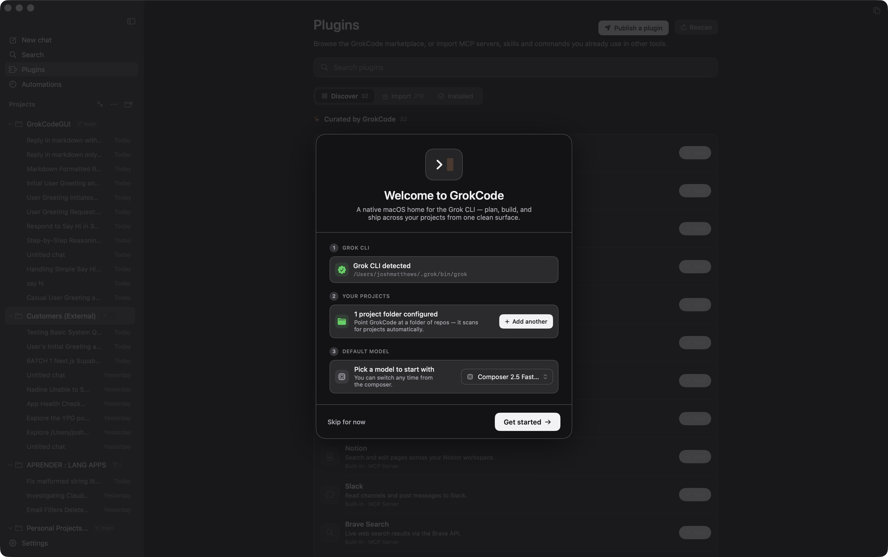
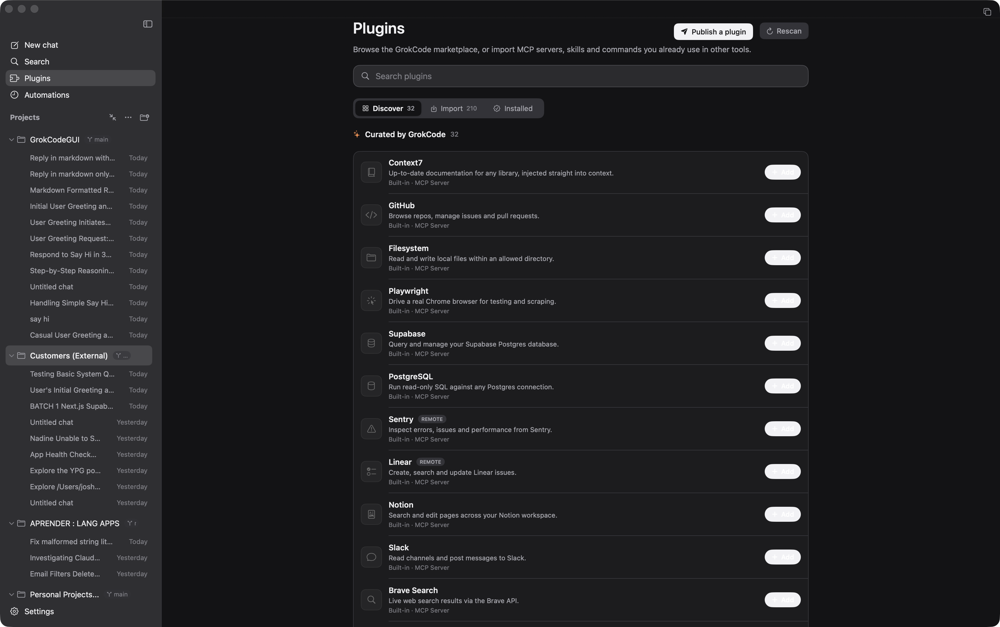
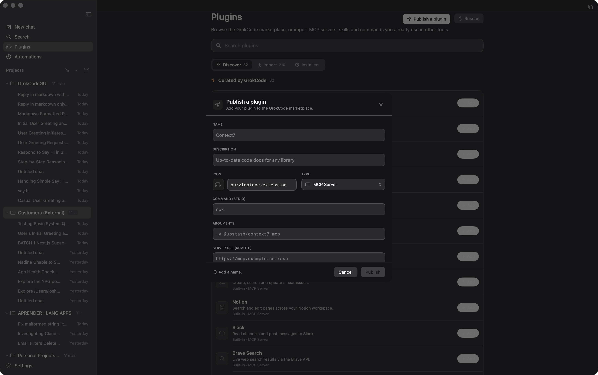

<div align="center">

# GrokCode

**A native macOS home for the Grok CLI. The ChatGPT‑Codex desktop experience, reimagined for Grok.**

[](https://www.apple.com/macos/)
[](https://swift.org)
[](https://developer.apple.com/xcode/swiftui/)
[](LICENSE)



</div>

---

## Why GrokCode

The `grok` CLI is fast — until every prompt pays a fresh **~30‑second cold start** while MCP servers boot from scratch. GrokCode kills that tax. It opens **one warm `grok agent stdio` session** when the app launches, keeps it alive, and streams every prompt down the same live ACP connection. MCP boots **once**; from then on reasoning and answers start arriving the instant you hit return.

On top of that warm core, GrokCode wraps the CLI in a real, native macOS app: markdown chat with copyable code blocks, a ⌘K command palette, slash‑commands and `@file` mentions, a plugin marketplace, scheduled automations, and project + git‑branch organisation — all keyboard‑driven, in full light and dark mode.

It is, deliberately, the ChatGPT‑Codex desktop feel — rebuilt from the ground up for Grok.

---

## Features

- **Warm streaming, no cold starts** — a persistent `grok agent stdio` session keeps MCP servers loaded between prompts, so reasoning and answers stream instantly instead of waiting on a fresh boot.
- **Rich markdown chat** — headings, lists, tables, inline code, and fenced **code blocks with one‑click copy**, plus a live "Thinking…" reasoning trace as the model works.

  

- **⌘K command palette** — jump to any project, session, page, or action without lifting your hands off the keyboard.

  

- **Composer that does anything** — type `/` for **slash‑commands** and `@` to **mention files** in the active project, pick your model, effort, and permission mode inline, then send or stop.
- **Plugin marketplace + in‑app publishing** — Discover community MCP servers, import a custom one, see what's Installed, and **publish your own** in a couple of clicks (more below).
- **Automations** — run a prompt **manually**, on an **interval**, or **daily** on a schedule, scoped to a project.
- **Projects & git‑branch organisation** — group sessions by project, organised by branch, with pin and archive.
- **Resizable, collapsible sidebar** — drag to resize, collapse for focus, grouped or flat project views.
- **Per‑project `AGENTS.md` editor** — edit the agent instructions that ship with each project, right inside the app.
- **First‑run onboarding** — a guided welcome that gets you from install to first prompt with zero guesswork.

  

- **Full light & dark mode** — a complete, hand‑tuned theme on both sides of the system appearance.
- **Keyboard‑driven everywhere** — new chat, search, settings, page switching, mode cycling, and stop are all one shortcut away.

---

## Install

### Download (recommended)

Grab the latest signed, notarized **`.dmg`** from the Releases page, drag GrokCode to **Applications**, and launch.

> **Download:** _[Releases → latest `.dmg`](https://github.com/logicleaplabs/grokcode/releases) — replace with the published release URL._

### Build from source

Requires **Xcode** and the **`grok` CLI** installed at `~/.grok/bin/grok`.

```bash
git clone https://github.com/logicleaplabs/grokcode.git
cd grokcode
xcodebuild -project GrokCode.xcodeproj -scheme GrokCode -configuration Release
```

The built app lands in the Xcode build products directory (or your configured `-derivedDataPath`). Open it and you're running.

---

## Requirements

- **macOS 15 or later** (Apple silicon or Intel).
- The **`grok` CLI** installed at `~/.grok/bin/grok`.
- A signed‑in CLI — run **`grok login`** once in your terminal before first launch.

GrokCode talks to your local `grok` install; it stores nothing in the cloud and phones no home.

---

## Keyboard shortcuts

| Shortcut | Action |
|---|---|
| `⌘N` | New chat |
| `⌘K` | Command palette |
| `⌘F` | Search |
| `⌘,` | Settings |
| `⌘1`–`⌘4` | Switch page (Home / Chat / Plugins / Automations) |
| `⇧⌘M` | Cycle permission / agent mode |
| `Esc` | Stop the current run |

---

## Plugins / Marketplace

GrokCode ships a built‑in marketplace for **MCP servers**, organised into three tabs:

- **Discover** — browse community plugins pulled live from the public marketplace manifest.
- **Import** — add a custom MCP server by command, args, URL, and environment.
- **Installed** — manage everything you've added, including enable/disable.



### Publishing a plugin

Built something worth sharing? Use **Publish a plugin** inside the app to generate a ready‑to‑submit manifest entry, then open a pull request against the marketplace repo.



The marketplace is just a single JSON file — anyone can contribute by adding an entry. See **[`logicleaplabs/grokcode-marketplace`](https://github.com/logicleaplabs/grokcode-marketplace)** for the manifest format and the PR workflow.

---

## Architecture

GrokCode is a focused, native stack:

- **SwiftUI** for the entire interface — windows, sidebar, chat, modals, and theming.
- **A custom menu / motion engine** (`CodexTheme` + `CodexMotion`) providing the named springs and design tokens that give the app its consistent, Codex‑like feel across light and dark.
- **An ACP JSON‑RPC client** (`GrokAgentSession`) that drives a long‑lived **`grok agent stdio`** process — the warm session that keeps MCP loaded and streams every prompt with no cold start.

State lives in a single `@Observable @MainActor` view model; the CLI layer spawns and parses `grok`, and a handful of small services index sessions, hooks, and the marketplace.

---

## Disclaimer

**Unofficial.** GrokCode is an independent, community project. It is **not affiliated with, sponsored by, or endorsed by xAI.** "Grok" is a trademark of xAI. GrokCode simply provides a desktop interface for the `grok` CLI that you install and run yourself.

---

## License

**MIT** — see [`LICENSE`](LICENSE).

Made by **LogicLeap Labs**.
